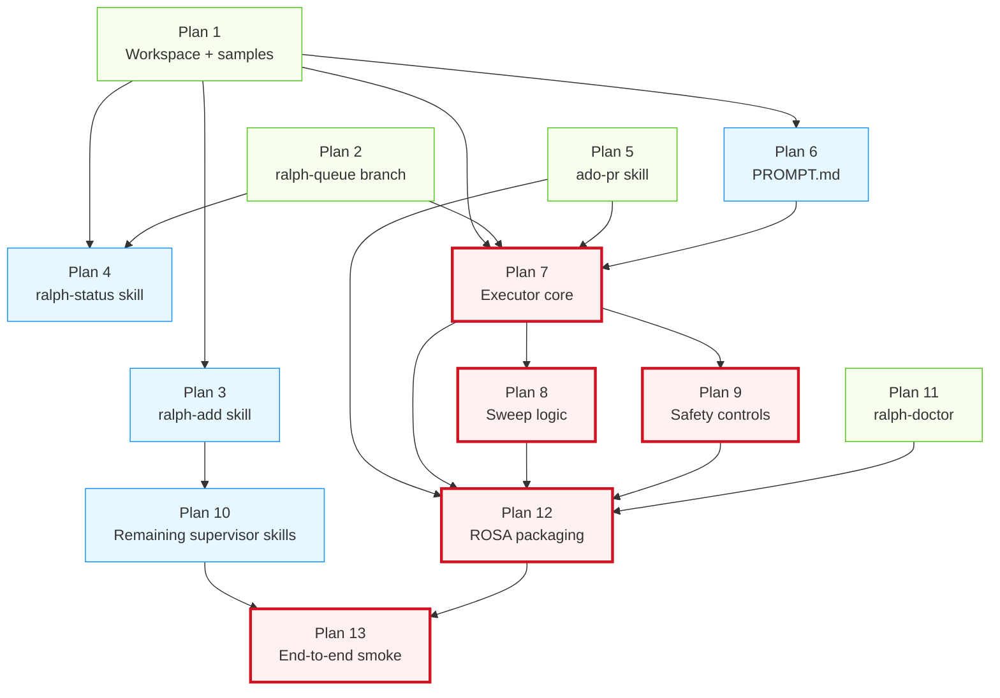

# Ralph v1 — Implementation Orchestrator Plan

> **For agentic workers:** This is the orchestrator plan. It does NOT contain implementation steps — it dispatches 13 sub-plans, defines their execution order, and the verification gates between them. Implementation work lives in the numbered sub-plans (`2026-05-24-01-*.md` through `2026-05-24-13-*.md`). Use `superpowers:subagent-driven-development` or `superpowers:executing-plans` to execute each sub-plan; this orchestrator tells you which sub-plan to run when.

**Spec reference:** [`2026-05-23-ralph-v1-per-repo-loop-design.md`](../specs/2026-05-23-ralph-v1-per-repo-loop-design.md)

**Goal:** Coordinate the implementation of Ralph v1 across 13 self-contained sub-plans, with explicit dependencies, conventions, and verification gates so that each sub-plan can be dispatched to a fresh subagent (or executed by a fresh engineer) without losing system coherence.

**Architecture:** Each sub-plan produces working, testable software for one component of Ralph v1. This orchestrator defines the execution order, shared engineering conventions, and integration points between plans.

**Tech Stack:** Python 3.12+, `uv` for environment management, `pytest` for tests, `ruff` for linting, `mypy` (strict) for type checking, Claude Code skills as Python entry points, ADO REST API. Git for the queue branch. (v2: AgentCore — out of scope here.)

---

## How to use this orchestrator

### For a single engineer (sequential)

1. Read the spec end-to-end.
2. Read this orchestrator.
3. Execute sub-plans in the order listed in [Execution order](#execution-order). After each, run the [Verification gate](#verification-gates) for that plan.
4. Don't skip dependencies (see the [Dependency graph](#dependency-graph)).

### For agentic execution (subagent-driven)

1. Dispatch one subagent per sub-plan. Subagents work on independent plans in parallel where the [Dependency graph](#dependency-graph) allows.
2. Each subagent invokes `superpowers:executing-plans` against its assigned sub-plan file.
3. After each sub-plan completes, run the [Verification gate](#verification-gates) before dispatching dependent sub-plans.
4. The orchestrator (you, or a coordinating Claude session) tracks completion state.

---

## Shared conventions — read once, apply everywhere

All sub-plans MUST follow these conventions. Sub-plans should NOT re-explain them; they assume you've read this section.

### Python project

- **Python version:** 3.12 or higher (use `python --version` to confirm; if missing, install via the team's standard tool — e.g. `uv python install 3.12`).
- **Package manager:** `uv` (install per https://docs.astral.sh/uv/getting-started/installation/). All dependency commands use `uv add` / `uv sync` / `uv run`.
- **Project layout:**
  - `ralph_executor/` — the Python executor package (created in Plan 7)
  - `ralph_executor/queue/` — queue-source + folder operations
  - `ralph_executor/safety/` — safety controls module (Plan 9)
  - `ralph_executor/sweep/` — sweep logic (Plan 8)
  - `ralph_executor/cli.py` — entry point for `ralph-executor`
  - `tests/` — parallel test tree (e.g. `tests/queue/test_filesystem.py`)
  - `skills/` — the Claude Code skills (each in its own subdirectory)
  - `samples/` — sample PBI directories used as test fixtures (Plan 1)
  - `pyproject.toml` — package config + tool configs
- **Test framework:** `pytest`. Run with `uv run pytest`. Test files named `test_*.py`. Test functions named `test_*`.
- **Linting:** `ruff` (config in `pyproject.toml`). Run with `uv run ruff check .` and `uv run ruff format .`.
- **Type checking:** `mypy` strict mode (config in `pyproject.toml` as `[tool.mypy] strict = true`). Run with `uv run mypy ralph_executor`.
- **Pre-commit gate (manual for v1):** `uv run ruff check . && uv run ruff format --check . && uv run mypy ralph_executor && uv run pytest` must pass before any commit beyond Plan 1.

### Claude Code skills

- **Skill location during development:** in the ralph repo at `skills/<skill-name>/` (each skill is a subdirectory).
- **Skill installation target on user machine:** `~/.claude/skills/<skill-name>/` (a future install script copies them; not in v1 scope).
- **Skill structure:**
  - `SKILL.md` — frontmatter (name, description) + body explaining the skill
  - `scripts/<operation>.py` — one Python file per operation the skill exposes (called via `python scripts/<operation>.py <args>` or similar)
  - `tests/test_<skill-name>.py` — pytest tests for the skill's Python operations
- **Skill entry point convention:** every operation script accepts `--help` (argparse) and supports stdin/stdout for piping.

### Git conventions

- **Branch model:**
  - `main` — default branch; all PRs land here
  - `ralph-queue` — long-lived branch holding `.ralph/` queue state (set up in Plan 2)
  - `ralph/<PBI-ID>` — per-PBI feature branches off main (created by the executor in Plan 7)
  - Implementation work for plans: each plan completes with a PR to `main` (or commits directly to `main` for early bootstrap plans 1-2)
- **Commit message format:** conventional commits (`feat:`, `fix:`, `test:`, `docs:`, `chore:`, `refactor:`). Example: `feat(executor): add queue-source filesystem reader`.
- **Frequent commits:** commit after every passing test (TDD red-green-commit). Don't accumulate large diffs.

### Environment variables (referenced across multiple plans)

| Variable | Used in | Purpose |
|---|---|---|
| `ANTHROPIC_API_KEY` | Plan 7 (executor), Plan 12 (pod) | Auth for Claude Code |
| `ADO_PAT` | Plan 5 (ado-pr skill), Plan 3 (ralph-add) | Personal Access Token for Azure DevOps |
| `ADO_ORG_URL` | Plans 3, 5 | Organisation URL (e.g. `https://dev.azure.com/myorg`) |
| `ADO_PROJECT` | Plans 3, 5 | ADO project name |
| `RALPH_REPO_PATH` | Plan 7 | Absolute path to the project repo Ralph operates on |
| `RALPH_QUEUE_BRANCH` | Plan 7 | Default: `ralph-queue` |
| `RALPH_MAIN_BRANCH` | Plan 7 | Default: `main` |
| `RALPH_MAX_ATTEMPTS` | Plan 9 | Default: `3` |
| `RALPH_ADO_AUTHOR_EMAIL` | Plan 8 | Email of the ADO service principal Ralph uses, so the sweep can distinguish Ralph-authored comments from reviewer comments |
| `RALPH_HALT_WEBHOOK` | Plan 9 | Webhook URL for halt-and-ack notifications; if unset, logs to stderr |
| `RALPH_RUN_ONCE` | Plans 7, 12 | When set (any non-empty value), executor runs exactly one iteration and exits — used by the pod smoke gate |
| `RALPH_LOG_LEVEL` | Plan 7 | Logging level for the executor (default `INFO`) |
| `RALPH_USE_BEDROCK` | Plan 11 | Switches `ralph-doctor`'s auth check from Anthropic API to AWS Bedrock |
| `RALPH_GIT_HOST` | Plans 2, 3, 5, 7, 11, 12 | **Required, no default.** `github` or `ado`. Set once per pod / per local dev session. Determines which host-specific skills the executor stages at startup. |
| `GH_TOKEN` | Plan 5, 11 (when `RALPH_GIT_HOST=github`) | GitHub PAT for the `pr` skill and `ralph-doctor` |
| `GH_OWNER` | Plan 5 (when `RALPH_GIT_HOST=github`) | GitHub org or user (e.g. `myorg`) |

### Code style

- **Type hints:** required on all function signatures (mypy strict enforces this).
- **Docstrings:** one-line minimum on public functions; longer for non-obvious behaviour. Don't restate the function name.
- **Error handling:** raise specific exceptions; never bare `except`. The executor's loop driver (Plan 7) catches and logs unexpected exceptions but lets keyboard interrupts propagate.
- **Logging:** use Python `logging` module. Logger name = module name. Level controlled by `RALPH_LOG_LEVEL` env var (default `INFO`).
- **No prints in library code.** CLI entry points may use `print()` for user output.

---

## Plan inventory

| # | File | One-line goal | Produces |
|---|---|---|---|
| 1 | `2026-05-24-01-workspace-samples.md` | Bootstrap Python project + sample PBI directories | `pyproject.toml`, `samples/feature-*/`, `samples/bug-*/`, `samples/pr-feedback-*/`, `samples/INVESTIGATE-template.md` |
| 2 | `2026-05-24-02-ralph-queue-branch.md` | Set up `ralph-queue` branch + branch protection on a test repo. **Phase 1** = GitHub branch protection (the script we run at home); **Phase 2** = ADO branch policy. | `scripts/setup_ralph_queue_github.py` (Phase 1), `scripts/setup_ralph_queue_ado.py` (Phase 2), runbook covering both |
| 3 | `2026-05-24-03-ralph-add-skill.md` | `ralph-add` skill (host-agnostic orchestrator) + `workitem-fetch-github/` (Phase 1). Phase 2 adds `workitem-fetch-ado/`. | `skills/ralph-add/`, `skills/workitem-fetch-github/`, `skills/workitem-fetch-ado/` (Phase 2), tests |
| 4 | `2026-05-24-04-ralph-status-skill.md` | `ralph-status` skill: read-only queue view (host-agnostic) | `skills/ralph-status/SKILL.md`, `skills/ralph-status/scripts/show.py`, tests |
| 5 | `2026-05-24-05-ado-pr-skill.md` | `pr` skill: create-pr, read-threads, reply, set-status, show. **Phase 1** = `pr-github/`; **Phase 2** = `pr-ado/`. Skills are host-pure; executor stages whichever one at startup. | `skills/pr-github/` (Phase 1), `skills/pr-ado/` (Phase 2), shared SKILL.md conventions, tests for both |
| 6 | `2026-05-24-06-prompt-md.md` | The standing PROMPT.md Ralph reads every iteration | `prompt/PROMPT.md`, plus a doc explaining how to iterate it |
| 7 | `2026-05-24-07-executor-core.md` | `ralph-executor` Python package: loop driver, queue-source, claude-p spawn, branch juggling, `current/` discipline | `ralph_executor/` package, `tests/` package |
| 8 | `2026-05-24-08-sweep-logic.md` | Sweep module: observe PR state changes, generate PR-feedback PBIs | `ralph_executor/sweep/`, tests |
| 9 | `2026-05-24-09-safety-controls.md` | STUCK.md handler + cycle detector + halt-and-ack | `ralph_executor/safety/`, tests |
| 10 | `2026-05-24-10-supervisor-skills.md` | `ralph-cancel`, `ralph-promote`, `ralph-triage` skills | `skills/ralph-cancel/`, `skills/ralph-promote/`, `skills/ralph-triage/`, tests |
| 11 | `2026-05-24-11-ralph-doctor.md` | `ralph-doctor` preflight skill | `skills/ralph-doctor/`, tests |
| 12 | `2026-05-24-12-rosa-packaging.md` | Container image + k8s manifests | `Dockerfile`, `manifests/ralph-pod.yaml`, build/push docs |
| 13 | `2026-05-24-13-end-to-end-smoke.md` | End-to-end smoke test on a throwaway repo | `tests/e2e/test_smoke.py`, smoke harness |

---

## Dependency graph



Legend: green = no dependencies (start anywhere); blue = depends on a small predecessor; red = critical path (largest scope or most dependents).

---

## Execution order

### Wave 1 — independent foundation (run in parallel)

- Plan 1: Workspace + samples
- Plan 2: ralph-queue branch (manual setup doc)
- Plan 5: ado-pr skill
- Plan 11: ralph-doctor skill

These have no dependencies on each other. Dispatch in parallel; verify each independently.

### Wave 2 — depends on Wave 1 (run in parallel after Wave 1 verified)

- Plan 3: ralph-add skill (depends on Plan 1)
- Plan 4: ralph-status skill (depends on Plans 1, 2)
- Plan 6: PROMPT.md (depends on Plan 1)

### Wave 3 — executor core (single critical-path item)

- Plan 7: Executor core (depends on Plans 1, 2, 5, 6)

Run after Wave 2 is verified. Largest scope of any single plan; expect this to take longest.

### Wave 4 — executor extensions (run in parallel after Plan 7)

- Plan 8: Sweep logic
- Plan 9: Safety controls

Both depend on Plan 7. Can run in parallel once Plan 7 is verified.

### Wave 5 — remaining supervisor skills (depends on Plan 3)

- Plan 10: ralph-cancel, ralph-promote, ralph-triage

Depends on Plan 3 (uses the same skill scaffolding pattern). Can run in parallel with Waves 3–4 if Plan 3 is done.

### Wave 6 — packaging (depends on most things)

- Plan 12: ROSA packaging (depends on Plans 5, 7, 8, 9, 11)

### Wave 7 — final integration

- Plan 13: End-to-end smoke (depends on Plans 10 and 12)

### Critical path

Plan 1 → Plan 6 → Plan 7 → Plan 9 → Plan 12 → Plan 13. About six sequential waves.

---

## Verification gates

After each plan completes (its tests pass, its PR is ready), run the corresponding verification gate before starting any dependent plan.

| After plan | Gate command(s) | Expected outcome |
|---|---|---|
| Plan 1 | `uv run pytest tests/ -k workspace` AND `ls samples/feature-* samples/bug-* samples/pr-feedback-*` | Tests pass; sample directories exist with all required files |
| Plan 2 | `git fetch && git branch -r \| grep ralph-queue` (on test repo) | `origin/ralph-queue` exists |
| Plan 3 | `uv run pytest tests/skills/test_ralph_add.py -v` | All pass |
| Plan 4 | `uv run pytest tests/skills/test_ralph_status.py -v` | All pass |
| Plan 5 | `uv run pytest tests/skills/test_ado_pr.py -v` | All pass (with mocked ADO) |
| Plan 6 | `cat prompt/PROMPT.md \| head -20` | Header + structure visible; smoke-tested by spawning `claude -p` against a sample PBI manually |
| Plan 7 | `uv run pytest tests/executor/ -v` | All pass; `uv run mypy ralph_executor` clean |
| Plan 8 | `uv run pytest tests/executor/test_sweep.py -v` | All pass |
| Plan 9 | `uv run pytest tests/executor/test_safety.py -v` | All pass; cycle detector triggers correctly on synthetic input |
| Plan 10 | `uv run pytest tests/skills/test_ralph_cancel.py tests/skills/test_ralph_promote.py tests/skills/test_ralph_triage.py -v` | All pass |
| Plan 11 | `uv run pytest tests/skills/test_ralph_doctor.py -v` | All pass |
| Plan 12 | `docker build -t ralph:test . && docker images \| grep ralph` | Image builds |
| Plan 13 | `uv run pytest tests/e2e/test_smoke.py -v` | End-to-end smoke passes against a throwaway repo |

---

## Cross-plan integration points

Things that span multiple plans and need to stay consistent. Sub-plans MUST use these names exactly.

### PBI frontmatter schema (defined in Plan 1, used by Plans 3, 4, 7, 8, 9, 10)

```yaml
---
id: <string>              # e.g. WI-1234, BUG-deploy-rosa-irsa-2026-05-23
type: <enum>              # feature | bug | pr-feedback
status: <enum>            # inbox | current | pending-pr | done | blocked | archive
severity: <enum>          # critical | high | normal | low
attempts: <int>           # executor-managed; starts at 0
created_at: <iso8601>     # set by ralph-add
updated_at: <iso8601>     # set on every mutation
---
```

### Queue folder layout (defined in Plan 1, used by Plans 3, 4, 7, 8, 9, 10)

```
.ralph/
├── inbox/<PBI-id>/
├── current/<PBI-id>/         # at most one entry
├── pending-pr/<PBI-id>/
├── done/<PBI-id>/
├── blocked/<PBI-id>/
├── archive/<PBI-id>/         # ralph-triage moves "won't fix" PBIs here (Plan 10)
└── state/                    # SQLite event log, halt sentinel, sweep state (Plans 8, 9)
```

### PBI directory contents (per type — defined in Plan 1)

- Feature: `PBI.md` (frontmatter + body), `PLAN.md`, `HISTORY.md`, optional `STUCK.md` / `CANCEL`
- Bug: `BUG.md` (frontmatter + body), `REPRODUCE.md`, `HISTORY.md`, optional `STUCK.md` / `CANCEL`
- PR-feedback: `FEEDBACK.md` (frontmatter + body), `PR-LINK.md`, `ORIGINAL.md`, `HISTORY.md`, optional `STUCK.md` / `CANCEL`

(Note: `INVESTIGATE.md` lives in the SERVICE repo at `docs/INVESTIGATE.md`, NOT inside the PBI directory.)

### Shared Python types (defined in Plan 7, used by Plans 8, 9, 10)

```python
# ralph_executor/types.py — defined in Plan 7

from dataclasses import dataclass
from datetime import datetime
from enum import Enum
from pathlib import Path
from typing import Literal

PBIType = Literal["feature", "bug", "pr-feedback"]
PBIStatus = Literal["inbox", "current", "pending-pr", "done", "blocked", "archive"]
Severity = Literal["critical", "high", "normal", "low"]

@dataclass(frozen=True)
class PBI:
    id: str
    type: PBIType
    status: PBIStatus
    severity: Severity
    attempts: int
    created_at: datetime
    updated_at: datetime
    path: Path  # absolute path to the PBI directory
```

Plans 8, 9, 10 import `PBI` from `ralph_executor.types`. The executor's `queue` module (Plan 7) is the canonical reader/writer of PBI directories.

### Skill operation conventions (defined in Plan 5, followed by Plans 3, 4, 10, 11)

Every skill operation script:
- Lives at `skills/<skill-name>/scripts/<operation>.py`
- Uses `argparse` for arguments
- Outputs JSON to stdout for machine-readable results, with a human-readable summary on stderr
- Exits non-zero on error; the error message goes to stderr
- Reads credentials from environment variables (NEVER takes them as CLI arguments)
- Has a corresponding test file at `tests/skills/test_<skill-name>.py`

### Verification commands inside individual plans

Each sub-plan ends its last task with a "Verification" step that runs the verification gate command from this orchestrator. Sub-plans are SELF-VERIFYING — they don't trust prior plans; they re-assert preconditions and verify postconditions.

---

## Dispatching guidance (for the agentic case)

A coordinating Claude session (this one, or a future one) dispatches subagents per plan. Each subagent prompt MUST include:

1. **Spec path:** `C:/Users/gethi/source/ralph/docs/superpowers/specs/2026-05-23-ralph-v1-per-repo-loop-design.md`
2. **Orchestrator path:** `C:/Users/gethi/source/ralph/docs/superpowers/plans/2026-05-24-00-orchestrator.md` (this file)
3. **Sub-plan to execute:** the specific file (e.g. `2026-05-24-07-executor-core.md`)
4. **Instruction:** invoke `superpowers:executing-plans` (or `superpowers:subagent-driven-development` for the largest plans) against the sub-plan.
5. **Working directory:** `C:/Users/gethi/source/ralph` (the ralph repo).
6. **Output expectation:** all changes committed; PR ready (or pushed to `main` for plans 1–2 which bootstrap the repo).

For parallel waves, dispatch all the wave's subagents in one turn with multiple `Agent` tool calls in a single message.

---

## v1 completion criteria

Ralph v1 is "done" when:

- All 13 plans have completed successfully (their verification gates pass)
- Plan 13's end-to-end smoke test passes consistently
- `uv run ruff check . && uv run mypy ralph_executor && uv run pytest` is green across the whole repo
- A demo run on a throwaway service repo shows: BA submits a PBI via `ralph-add`, executor picks it up, Ralph closes it via PR, the PR auto-merges, `ralph-status` shows it as done

Any deviation gets a follow-up plan, not a hack.

---

## Host selection architecture — GitHub (Phase 1) and ADO (Phase 2)

Ralph supports two git-host backends: **GitHub** and **Azure DevOps**. The choice is made once per pod (or once per local dev session) via `RALPH_GIT_HOST` and is fixed for that pod's lifetime. The executor stages the chosen host's skills at startup; Claude never sees both.

### Why this shape

- **Skills are host-pure**, not host-aware. Each skill implementation deals with one backend only — no `if HOST == "github"` ladders inside scripts.
- **The executor is the multiplexer.** At startup, it reads `RALPH_GIT_HOST`, stages the matching skills, and verifies auth env vars are present for that host. Same pattern as every other "executor controls Claude" property in the design.
- **Phase 1 = GitHub.** Built by humans at home, used to dogfood Ralph against real GitHub projects.
- **Phase 2 = ADO.** Built by Ralph (or humans) for work deployment. The Phase 2 work is host-pure too: separate skill files implementing the same operation surface as Phase 1's GitHub skills.

### Skill staging at startup

The executor's startup phase (before the iteration loop) does:

1. Read `RALPH_GIT_HOST` (fail fast if unset).
2. Verify the host's auth env vars are present (`GH_TOKEN`+`GH_OWNER` for `github`; `ADO_PAT`+`ADO_ORG_URL`+`ADO_PROJECT` for `ado`).
3. Stage the chosen skill directories into the Claude skills location:
   - `skills/pr-github/` → exposed to Claude as `pr/` (when host is `github`)
   - `skills/pr-ado/` → exposed to Claude as `pr/` (when host is `ado`)
   - `skills/workitem-fetch-github/` → exposed as `workitem-fetch/` (when host is `github`)
   - `skills/workitem-fetch-ado/` → exposed as `workitem-fetch/` (when host is `ado`)
4. Verify the stage worked (the `pr` and `workitem-fetch` skill directories exist with the expected scripts).
5. Write `.claude/settings.json` with `permissions.allow` entries — same skill names regardless of host.

Staging can be symlink (Linux/Mac) or copy (Windows / when symlinks aren't available). Both work; symlink is faster.

**Alternative — pre-staged image (Plan 12):** the Dockerfile can do the staging at build time using a `--build-arg RALPH_GIT_HOST=github|ado` flag, producing host-specific images. Then there's no runtime staging at all. Plan 12 documents both approaches; either works.

### Skills affected

| Skill | GitHub variant (Phase 1) | ADO variant (Phase 2) |
|---|---|---|
| `pr` | `pr-github/` — uses `gh` CLI or GitHub REST | `pr-ado/` — uses ADO REST via `ado_client.py` |
| `workitem-fetch` | `workitem-fetch-github/` — GitHub Issues API | `workitem-fetch-ado/` — ADO Work Items REST |

The other skills (`ralph-add`, `ralph-status`, `ralph-cancel`, `ralph-promote`, `ralph-triage`, `ralph-doctor`) are host-agnostic in their orchestration but `ralph-doctor` probes one host at a time based on `RALPH_GIT_HOST`.

### Plans affected

- **Plan 2** — splits into Phase 1 (GitHub branch protection script) + Phase 2 (ADO branch policy script). Both produce a single Python helper for their host, plus a runbook covering both.
- **Plan 3** — `ralph-add` becomes a host-agnostic orchestrator that calls the staged `workitem-fetch/` skill. Plan 3 also delivers Phase 1's `workitem-fetch-github/`. Phase 2's `workitem-fetch-ado/` is a follow-up.
- **Plan 5** — split into Phase 1 (`pr-github/` skill) + Phase 2 (`pr-ado/` skill). Both implement the same 5 operations.
- **Plan 7** — executor adds `host_select.py` (~100 lines) that runs at startup, stages skills, verifies auth.
- **Plan 11** — `ralph-doctor` probes one configured host. Adds a check that the staged skills directory matches `RALPH_GIT_HOST`.
- **Plan 12** — Dockerfile adds `ARG RALPH_GIT_HOST` and conditional `COPY` of the appropriate skills, producing host-specific images. Alternative: runtime staging via Plan 7's `host_select.py`.

The other 7 plans (1, 4, 6, 8, 9, 10, 13) are unchanged — they're already host-agnostic.

### Phase order

Phase 1 (GitHub) work is everything needed to run Ralph at home on real GitHub repos. Phase 2 (ADO) work is everything needed to run Ralph at work on ADO repos — and is itself a candidate for being built BY Ralph running on GitHub. The bootstrap order described in the spec's "Ralph builds Ralph" discussion fits naturally: humans build Phase 1, then Ralph picks up Phase 2 PBIs.

---

## Cross-plan reconciliation notes (read before executing dependent plans)

This appendix captures integration concerns flagged by the subagents that wrote each sub-plan. Each item lists the plans involved, the concern, and the recommended reconciliation. The implementer of a dependent plan should resolve these AT INTEGRATION TIME (not by editing the sub-plans pre-execution — sub-plans are otherwise self-contained).

### 1. Executor CLI / env contract — Plans 7, 12, 13

- **Plan 7** implements `--once` flag for single-iteration testing.
- **Plan 12** assumes `RALPH_RUN_ONCE` env var, plus `ralph-executor health --ready/--live` and `ralph-executor doctor --json` subcommands for k8s probes and pre-deploy gates.
- **Plan 13** assumes `--iterations N` flag for controlled smoke runs.

**Reconciliation**: Plan 7's `cli.py` should expose ALL of:
- `--once` (alias for `--iterations 1`) — kept for backward compat with Plan 7's tests
- `--iterations N` — explicit count
- `RALPH_RUN_ONCE` env var support (parsed in `config.py`, takes effect if `--iterations` not supplied)
- `ralph-executor health --ready` and `ralph-executor health --live` subcommands (return 0 if executor is healthy; minimal stubs acceptable for v1)
- `ralph-executor doctor --json` subcommand that shells out to the `ralph-doctor` skill and reformats its output

Add these to Plan 7 during execution; they're small additions to `cli.py`. If conflicts arise, prefer the broader surface (all four) — none of them are mutually exclusive.

### 2. `.ralph/archive/` folder — Plans 1, 7, 10

- **Plan 10**'s `ralph-triage` skill moves "won't-fix" PBIs to `.ralph/archive/`.
- **Plan 1**'s folder layout (as the subagent wrote it) lists only inbox/current/pending-pr/done/blocked. The status enum already includes `archive`, so the SCHEMA is fine; only the documented folder list is missing it.
- **Plan 7**'s queue-source should not enumerate `archive/` when picking the next PBI (it's terminal, like `done/`).

**Reconciliation**: when executing Plan 1, also create `.ralph/archive/.gitkeep`. When executing Plan 7's `FilesystemQueueSource`, ignore `archive/` in the priority-lane scan (same handling as `done/`). The orchestrator's "Queue folder layout" section above has been updated to include `archive/` and `state/`.

### 3. PBI directory naming convention — Plans 1, 3, 4

- **Plan 1**'s validator requires directory names prefixed `feature-`/`bug-`/`pr-feedback-` so it can cross-check the prefix against frontmatter `type`.
- **Plan 3**'s `ralph-add` writes directories named just `<WI-id>` (e.g. `WI-1234`) — the canonical ID form, no type prefix.
- **Plan 4**'s `ralph-status` reads whatever's there.

**Reconciliation**: the canonical on-disk directory name is `<PBI-ID>` (no type prefix). Plan 1's validator should be amended at execution time to derive type from the frontmatter `type` field rather than the directory prefix. Type-prefixed names in Plan 1's `samples/` directory are fine because they're sample fixtures — they don't have to match the queue convention. Plan 3's Task 4 (which mirrors directories into a typed-name copy for validation) becomes unnecessary once the validator is amended; if you keep the mirror step, that's harmless redundancy.

### 4. PR-feedback queue ado-pr operations — Plans 5, 8

- **Plan 5** lists 5 operations including separate `show` and `read-threads`.
- **Plan 8** assumes `show` returns top-level state (status, CI) and `read-threads` returns the thread list — these are separate ops.

**Reconciliation**: confirmed aligned. Keep them as separate operations per Plan 5's design. Plan 8's `pr_state.fetch` calls both.

### 5. `ado-pr` exit code 3 — Plans 5, 7, 8

- **Plan 5** introduces exit code 3 for ADO REST errors (distinct from exit 2 for validation errors).
- **Plans 7 and 8** invoke `ado-pr` from the executor.

**Reconciliation**: when Plan 7's `claude_spawn.py` and Plan 8's `pr_state.py` interpret `ado-pr` subprocess exit codes, treat:
- 0 → success
- 2 → validation error (likely a Ralph bug — log and move PBI to blocked/)
- 3 → ADO REST error (likely transient — log and retry next iteration; only move to blocked/ if attempts ≥ max)
- other non-zero → unknown (log, move to blocked/)

### 6. `_split_frontmatter` private-name import — Plans 1, 4

- **Plan 4** imports `_split_frontmatter` (leading-underscore, private convention) from Plan 1's `scripts/validate_samples.py`.
- Plan 1's lint ruleset doesn't enforce private-name access rules, so it passes today.

**Reconciliation**: factor out a shared `scripts/pbi_frontmatter.py` (public API) at Plan 4's execution time, or rename `_split_frontmatter` to `split_frontmatter` in Plan 1's validator (single-line change). Either is fine; prefer the rename for minimal scope.

### 7. Plan 6 prompt-loading flag — Plan 6

- **Plan 6**'s smoke test uses `claude --append-system-prompt <text>` rather than `--prompt-file`.

**Reconciliation**: verify against the installed Claude Code CLI at execution time. The flag name varies by version; the spec referenced `--prompt-file` but `--append-system-prompt` is what current Claude Code uses for system-prompt layering. Adjust the smoke test to match the installed CLI's `--help` output.

### 8. Plan 10's structural placeholder — Plan 10

- **Plan 10** Task 8 step 4 contains `# ... existing body unchanged ...` inside a Python comment block where the rest of Plan 3's `main()` body would go.

**Reconciliation**: this is one explicit placeholder by design — Plan 10 refactors part of Plan 3's `main()` but preserves the rest unchanged. The implementer copies Plan 3's `main()` body verbatim into the refactored function and only changes the parts Plan 10 specifies. If you want zero placeholders, inline Plan 3's main body in Plan 10 Task 8 (~150 line addition).

### 9. Plan 9 ↔ Plan 7 loop integration — Plans 7, 9

- **Plan 9**'s diff against Plan 7's `loop.py` is contract-style, not a literal patch.
- **Plan 7** exposes hook points via module-path monkeypatchable functions (`spawn_claude_p`, `_run_sweep`, `_check_cycle_detector`).

**Reconciliation**: Plan 9 replaces the bodies of Plan 7's stub hook functions in-place (don't introduce new injection mechanisms). The integration test in Plan 9 Task 7 must use the same monkeypatch convention as Plan 7's tests. Verify Plan 7's exact function names at Plan 9 execution time and adjust the diff accordingly.

### 10. `ralph-status --json` shape — Plans 4, 13

- **Plan 4** defines the JSON output shape.
- **Plan 13**'s smoke test tolerates two possible shapes (top-level `done` key OR nested under `by_state.done`).

**Reconciliation**: Plan 4's actual output should be `{"by_state": {"inbox": [...], "current": [...], ...}, "totals": {"by_state": {...}, "by_severity": {...}}}`. Plan 13's tolerant check is fine; the canonical shape is nested under `by_state`.

### 11. `ralph-doctor` ADO check bypasses `AdoClient` — Plans 2, 11

- **Plan 11**'s `checks/ado.py` uses `requests` directly because it needs 404-as-success (Plan 2's `AdoClient` raises on 404).

**Reconciliation**: keep the direct-requests usage in `ralph-doctor` — it's a single-purpose probe, documented in the plan. Don't try to mutate `AdoClient` to support a "404 is OK" mode for one caller.

### 12. Subagent assumptions about earlier plans

Several subagents wrote their plans before the plans they depend on existed on disk (the dispatches were parallel). The plans contain "Cross-plan assumptions ledger" sections that document what they assumed about sibling plans. At execution time, when a plan's dependencies are real on disk, verify the assumed interfaces match — adjust the plan in flight if not. Plans noted for this: 4 (assumes Plan 2's `ralph-queue` exists), 8 (assumes `LoopContext.ado_pr_scripts_path` from Plan 7), 9 (assumes Plan 7 module names), 12 (assumes Plan 7's health/doctor subcommands), 13 (assumes Plan 7's `--iterations`).

---

## What this orchestrator deliberately doesn't do

- It does NOT implement code. All implementation lives in sub-plans.
- It does NOT include verification of v2 features (memory, watchers, supervisor service) — those are out of scope.
- It does NOT define the AgentCore integration — that's the other Claude's slice (a separate orchestrator + plans, likely living in the better-memory repo).
- It does NOT manage branch policies on the test repo's main branch — Plan 2 covers `ralph-queue` only.
