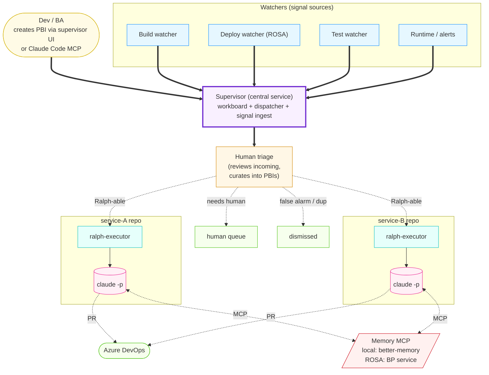
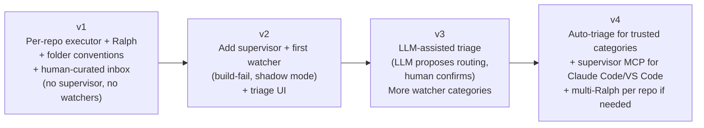

# Ralph — Umbrella Design

**Status:** Approved (design phase) — reference only, not implemented in v1
**Date:** 2026-05-23
**Author:** gethin (with Claude)

## Purpose of this document

This is the **umbrella spec**. It describes the eventual full Ralph system — five independent subsystems that, together, form an autonomous-but-curated coding loop. None of this is built in v1.

The v1 sub-project (per-repo Ralph loop) is specified separately in [2026-05-23-ralph-v1-per-repo-loop-design.md](./2026-05-23-ralph-v1-per-repo-loop-design.md). That spec is what gets implemented first. This umbrella exists so the v1 design fits coherently into a known target shape.

## Goal

An always-on coding loop that drains a curated queue of work items (features and bugs) per service repository, producing pull requests, and gets meaningfully better at it over time. Humans triage and curate; Ralph executes. CI and reviewers gate merges. Signals from build / deploy / runtime / test failures feed back into the queue.

The shape is roughly: **Ralph is the actuator. The supervisor and watchers are the sensors and routing. Most of the engineering effort goes into the sensors and routing — Ralph itself stays small.**

## Non-goals

- Replacing developers. Ralph operates inside a human-curated workflow; it does not invent its own tasks.
- Autonomous design or architectural decisions. Plans come from humans.
- Cross-repo refactoring. Each Ralph is scoped to one repo. Cross-cutting changes happen through human-decomposed PBIs, one per repo.
- Real-time interactive coding. Ralph is fire-and-forget per work item; reviewers interact with PRs, not with Ralph directly.
- Production deployment authority. Ralph proposes via PR; humans (or policy) approve merge.

## Constraints and context

- **Platform**: BP corporate environment.
- **Runtime targets**: developer laptop (local-first development), and ROSA pods for unattended operation.
- **PBI / work-item system of record**: Azure DevOps. Watchers and the supervisor write into ADO; Ralph reads what humans have routed.
- **Code repos**: per-service git repositories (likely Azure Repos).
- **CI / deploy**: existing pipelines (build, test, deploy to ROSA). Ralph adds a "guards" job to these pipelines as a required check.
- **Memory backend**: locally, [better-memory](https://github.com/emp3thy/better-memory) (the author's personal MCP). On ROSA, a BP-approved memory service exposing the same MCP interface. The Ralph code is identical against either.
- **Authentication**: API keys / managed identities on ROSA; OAuth not viable for unattended operation.

## Five subsystems

The whole system, in eventual form:

### 1. Supervisor (central service)

The workboard. Single web service per organisation (or per team) that:

- Provides a UI for humans to triage incoming items (route to Ralph / route to human / dismiss)
- Exposes an MCP (and probably a VS Code extension) so devs can create PBIs from Claude Code or the IDE
- Ingests signals from watchers, dedups, classifies, and surfaces them in the triage view
- Tracks PBI status across the fleet of per-repo executors (pull from executor / push status)
- Renders the visible work-state of the organisation: PBIs in flight, blocked, done, by service, by severity

The supervisor does not directly write to executor inboxes. It records human triage decisions, and executors pull from the supervisor's queue API (or it pushes to their inboxes — TBD; see v2 design).

### 2. Watchers (signal sources)

One watcher process per signal type. Each:

- Listens to a stream (CI events, ROSA controller events, test runner outputs, runtime alerts)
- Extracts the relevant signal from the noise (first real error, not cascades; structured context around it)
- Dedups against recent identical signatures
- Classifies (compile / test / deploy / runtime; severity)
- Writes a structured alert to the supervisor's triage queue

Watchers do not talk to Ralph. They feed humans, who curate.

The v2 design will start with the **build-fail watcher** because builds produce the most structured failures. Shadow-mode rollout: watcher runs, generates alerts, humans review but ignore (still triage manually). Compare: would the watcher's alert have helped? Iterate until "yes" most of the time, then promote to assisted-triage mode.

### 3. Per-repo executor + Ralph

One Python `ralph-executor` process per service repo. Inside the repo (typically running on a ROSA pod, but also runs locally for development).

- Manages a `.ralph/` queue on the filesystem (state-tracked via folder location)
- Each iteration: sweep open PRs from prior iterations for state changes, then pick the next work item and spawn `claude -p`
- Fire-and-forget — Ralph creates a PR and exits; the executor does NOT wait for CI
- Owns safety controls (cycle detection, halt-and-ack)
- Reads/writes memory via MCP

This is the v1 sub-project. See the v1 spec.

### 4. Memory backend (interchangeable MCP)

A memory service exposing a stable MCP interface. Ralph's code is identical against any implementation.

- **Local**: better-memory (author's personal MCP). Used during development.
- **ROSA**: BP-approved memory service implementing the same MCP. TBD which specific service; the contract is what matters.

Ralph reads (retrieve) at the start of each PBI, writes (observe) at PBI completion, and receives credit (record_use) based on PBI outcomes — green merge = success; rolled-back fix = failure.

Reflections (cross-episode synthesis) are not produced by Ralph in v1. They come from periodic batch jobs (or the existing better-memory synthesis flow). Ralph is a memory consumer, not a memory curator.

### 5. Skills family (Claude Code skills)

`~/.claude/skills/ralph-*` — a small set of skills humans use to set up and operate Ralph:

- `ralph-init` — set up a repo for Ralph (PROMPT.md, ralph-safe settings.json, control-repo wiring, MEMORY init).
- `ralph-doctor` — pre-flight check: are we in a ralph-safe config? Any unsafe hooks/skills/permissions? Pass/fail with specifics. **The most important skill** — run before pushing the executor image to ROSA, otherwise silent permission-prompt hangs are inevitable.
- `ralph-run` — drive the loop locally for testing the prompt and iterating.
- `ralph-triage` — human-side: walk the `blocked/` queue, classify stuck reasons, return PBIs to inbox or close them out.
- `ralph-organiser-init` — set up the org-level supervisor with watchers and queues. (v2+)
- `ralph-watcher` — add or configure a failure-signal watcher. (v2+)

Most skills come later than the executor. The exception is `ralph-doctor`, which is required for v1 ROSA deployment — a silent permission-prompt hang on a pod is the failure mode the doctor preflight prevents. Other skills (`ralph-init`, `ralph-triage`, etc.) package the repeatable parts once they stabilise, after v1 is running.

## Cross-cutting principles

### Human triage is load-bearing safety

Ralph never receives raw watcher output or unfiltered ADO tickets. Everything that lands in `.ralph/inbox/` has been reviewed by a human (or, eventually, an automated triage Ralph that humans audit). This means:

- Ralph runs in a narrow, well-behaved distribution
- Cycle detection rarely trips because impossible tasks don't enter the queue
- Memory accumulates signal, not noise
- Postmortems are tractable ("a human approved this task")

The other safety layers (Ralph self-halt, CI guards, cycle detection) are belt-and-braces — they catch the rare bad-task that slipped triage, not a steady stream of impossible work.

### Fire and forget

Ralph creates a PR and exits. The executor's iteration-start sweep handles async state transitions for prior PRs (merged → done; closed → blocked; new review comments → create PR-feedback work item). PR guards run as a required CI check in the pipeline — GitHub/ADO enforces the gate, not the executor.

This keeps Ralph busy (no idle waiting) and makes the executor stateless-per-iteration. Crash recovery is trivial: restart, re-derive state from `.ralph/` folder structure on disk.

### Same Ralph, multiple work-item types

Features get a PLAN.md; bugs get a BUG.md + REPRODUCE.md + INVESTIGATE.md; PR feedback gets a boilerplated FEEDBACK.md. Same Ralph, same executor, different inputs. Priority lanes determine ordering: PR feedback (close out open PRs) → critical/high bugs → normal/low bugs → features.

A separate Ralph for PR feedback is a v2 optimization if data shows the single Ralph becomes a bottleneck. v1 does it with one Ralph and priority lanes.

### Memory carries forward knowledge

Each iteration of Ralph is a fresh Claude session — no carry-over between PBIs. Memory (via MCP) is how Ralph gets better:

- **Retrieve** at the start of each PBI, keyed off the PBI subject
- **Observe** episodic facts at PBI completion (root cause, fix pattern, gotchas)
- **Credit** retrieved memories on outcome (success on green merge; failure if reopened or rolled back)
- **Reflections** are synthesised periodically (out-of-band) from episodic observations — Ralph does not write reflections directly

The asymmetry matters: Ralph reads everything but writes only episodic. Reflection synthesis stays human-supervised so confidently-wrong patterns don't crystallise into "the way to do it".

## Roadmap

- **v1** (this design) — per-repo executor + Ralph + folder conventions + human-curated inbox. No supervisor, no watchers. Humans write PBIs directly into `.ralph/inbox/`.
- **v2** — supervisor service + triage UI + first watcher (build-fail) in shadow mode. Watchers feed supervisor's triage queue; humans still curate.
- **v3** — LLM-assisted triage (cheap LLM proposes routing, human confirms). More watcher categories (deploy, test, runtime).
- **v4** — auto-triage for trusted categories (with human audit log). Supervisor MCP for Claude Code / VS Code integration. Multi-Ralph if throughput demands it.

Each step is incremental confidence-building. We do not jump to auto-triage without data on what Ralph handles well.

## Open questions for the umbrella (not blocking v1)

- **Supervisor data store** — relational DB, document store, or a thin git-based layer? The audit trail benefits of git are real; the query patterns of a workboard favour a real DB. Likely a real DB with a git mirror for audit.
- **Multi-tenant supervisor or per-team**? An org-wide supervisor with team-scoped views is more useful but heavier to operate. v2 likely starts per-team.
- **PBI sync to ADO** — bidirectional? Push-only from supervisor to ADO? TBD based on what teams already use.
- **Memory backend for ROSA** — specific BP service is TBD. The MCP contract is what we design against.

These are real questions but they don't change the v1 scope — v1 doesn't include the supervisor or watchers at all.
