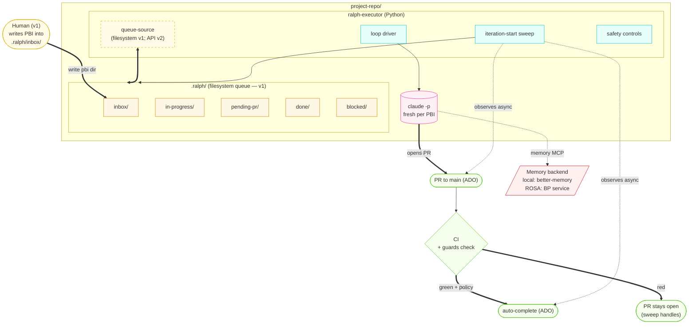
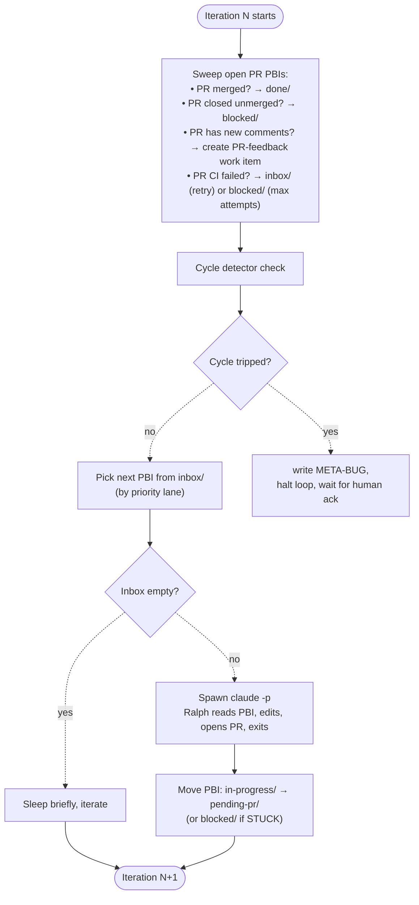

# Ralph v1 — Per-repo Loop Design

**Status:** Approved (design phase)
**Date:** 2026-05-23
**Author:** gethin (with Claude)
**Supersedes:** N/A (initial design)
**Umbrella reference:** [2026-05-23-ralph-umbrella-design.md](./2026-05-23-ralph-umbrella-design.md)

## Goal

A Python `ralph-executor` process that runs inside a project repository and drives an autonomous coding loop. Each iteration: sweep open PRs from prior iterations for state changes, then pick the next work item from `.ralph/inbox/`, spawn `claude -p` against it, and let Ralph open a PR. Ralph fires and forgets — the executor never waits for CI or human review.

v1 runs both locally (developer laptop) and on a ROSA pod (unattended) from a single binary, with environment-specific config differences only. Humans write PBIs directly into `.ralph/inbox/`; the supervisor and watchers are out of scope until v2.

## Non-goals

- **No supervisor service.** Humans write PBI directories by hand into `.ralph/inbox/`. The supervisor (with UI, MCP for Claude Code, signal ingestion) is v2.
- **No automated watchers.** Build / deploy / test / runtime watchers come in v2 alongside the supervisor.
- **No multi-Ralph per repo.** One executor per repo in v1. Multi-Ralph is v4+ if throughput demands it.
- **No automated triage Ralph.** All work entering Ralph's inbox is human-curated.
- **No reflection synthesis by Ralph.** Ralph reads memory and writes episodic observations; reflection synthesis is out-of-band (e.g. the existing better-memory synthesis flow).
- **No cross-repo coordination.** Each Ralph is scoped to one repository.

## Constraints

- **Runtime targets**: developer laptop (Windows/Mac/Linux) AND ROSA pod (Linux container). Same binary, different config.
- **PR target**: PRs go to Azure DevOps (`az repos pr`, ADO REST API). Not GitHub.
- **Memory backend**: local development uses [better-memory](https://github.com/emp3thy/better-memory) (MCP). ROSA uses a BP-approved memory service exposing the same MCP interface. The executor and Ralph are identical against either.
- **Authentication**: API key (Anthropic) or IAM role (Bedrock) for Claude. PAT or managed identity for ADO. No OAuth-based auth in pod mode.
- **Queue storage**: `.ralph/` directory inside the project repo, git-tracked. Chosen so a failed pod run reproduces locally by cloning the repo at the failing commit. Cost is queue churn in git log (mitigated by distinctive commit author / message prefix; possibly a separate `ralph-queue` branch — see open questions).

## Architecture



### Components

- **`.ralph/`** — queue state on the filesystem. Folder location = PBI state. Folders are git-tracked so a failed pod run reproduces locally.
- **`ralph-executor`** — Python process with three concerns:
  - **queue-source**: reads from `.ralph/inbox/` in v1; in v2 will read from supervisor API. Abstracted so the loop doesn't care.
  - **loop driver**: spawns `claude -p` per PBI with the prompt + PBI directory path.
  - **safety controls**: STUCK.md handling, attempt counter, cycle detection, global halt.
- **`claude -p`** — fresh Claude session per PBI. Reads PROMPT.md (standing instructions at repo root) + PBI directory contents. Edits code, opens a PR via `az repos pr create`, exits.
- **PR guards (CI job)** — runs as a required ADO pipeline check on Ralph PRs. Refuses merge if guards fail. Not part of the executor.
- **Memory MCP** — provides `memory.retrieve`, `memory.observe`, `memory.record_use` to Ralph. Implementation behind the MCP is swappable (better-memory locally, BP service on ROSA).

## PBI conventions (folder layout, not schema)

A PBI is a **directory** with conventional file names. Frontmatter on the top-level file is minimal — just enough for the executor to schedule. Everything Ralph needs to do the work is in adjacent markdown files.

### Folder structure (general)

```
.ralph/inbox/<PBI-ID>/
├── (type-specific files — see below)
├── HISTORY.md      ← appended by executor after each attempt
├── STUCK.md        ← written by Ralph if it can't proceed (per-PBI halt)
└── CANCEL          ← empty file dropped by humans to abandon
```

### Feature PBI

```
.ralph/inbox/WI-1234/
├── PBI.md          ← human-written ask (context, acceptance prose, constraints)
├── PLAN.md         ← step-by-step implementation plan (superpowers-style)
├── HISTORY.md
├── STUCK.md / CANCEL
```

**Top-of-file frontmatter on PBI.md:**

```yaml
---
id: WI-1234
type: feature
status: inbox       # executor-managed: inbox | in-progress | pending-pr | done | blocked | archive (verifying added in v2)
severity: normal    # critical | high | normal | low
attempts: 0         # executor-managed
---
```

**Processing**: Ralph reads PROMPT.md → HISTORY.md → PBI.md → PLAN.md, does the next unchecked step in PLAN.md, marks it done, commits, opens PR. Next iteration on the same PBI picks up where this one left off (multi-step features take multiple iterations).

### Bug PBI

```
.ralph/inbox/BUG-xxx/
├── BUG.md          ← failure context, signature, error excerpts
├── REPRODUCE.md    ← commands that demonstrate the failure locally
├── INVESTIGATE.md  ← debugging playbook for this CLASS of bug
├── HISTORY.md
├── STUCK.md / CANCEL
```

**Frontmatter on BUG.md:**

```yaml
---
id: BUG-deploy-rosa-irsa-2026-05-23
type: bug
status: inbox
severity: critical
attempts: 0
---
```

**Processing**: Ralph reads PROMPT.md → HISTORY.md → BUG.md → REPRODUCE.md → INVESTIGATE.md. Confirms it can reproduce the failure. Forms a hypothesis from INVESTIGATE.md. Applies a fix. Re-runs REPRODUCE.md commands. If they pass, opens PR. If not, appends HISTORY.md and exits — next iteration tries a different angle.

INVESTIGATE.md is per **category** of bug (e.g. `deploy-fail-rosa-irsa`, `build-fail-go-compile`, `test-flake-network`), not per-bug. The human triager attaches the appropriate one from a library (the **INVESTIGATE.md library**, maintained in a shared location — see open questions).

### PR-feedback PBI

```
.ralph/inbox/PR-feedback-WI-1234-r2/
├── FEEDBACK.md     ← templated content (PR link, comments, instructions to Ralph)
├── PR-LINK.md      ← url, branch, commit at time of feedback
├── ORIGINAL.md     ← copy of (or reference to) the original PBI
├── HISTORY.md
├── STUCK.md / CANCEL
```

**Frontmatter on FEEDBACK.md:**

```yaml
---
id: PR-feedback-WI-1234-r2
type: pr-feedback
status: inbox
severity: high      # high priority lane: closing PRs unblocks reviewer context
attempts: 0
---
```

**Processing**: Ralph reads PROMPT.md → HISTORY.md → ORIGINAL.md → FEEDBACK.md. Checks out the existing PR branch. For each active comment: decides correct/not/unclear, applies fix or prepares challenge, posts reply, sets ADO thread status (`fixed` if applied; leave `active` if challenged). Pushes commits to the same branch — the existing PR auto-updates.

The FEEDBACK.md template is the contract between the sweep (which generates it) and Ralph (which processes it). Same boilerplate every round.

## Iteration model — fire and forget

Ralph creates a PR and exits. The executor's iteration-start sweep handles async state transitions for prior PRs.



### Sweep logic per pending PR

| PR state | Action |
|---|---|
| Merged (`completed` in ADO) | mv PBI to `done/` (v1: features AND bugs). Credit retrieved memories with `success`. Append HISTORY.md. (v2 adds `verifying/` step for bugs.) |
| Abandoned | mv PBI to `blocked/` with reason from PR. Memory not credited. |
| Open, CI red | If attempts < max → mv PBI to `inbox/` for retry; close PR. If attempts ≥ max → mv to `blocked/`. |
| Open, CI green, awaiting review | No-op. Auto-complete (ADO equivalent of auto-merge) is configured on the PR; merges when policies pass. |
| Open, new active comments since last sweep, not Ralph-authored | Create `PR-feedback` work item in `inbox/`. Update `last_feedback_sweep` timestamp on PBI. PBI stays in `pending-pr/`. |
| Open, stale (no movement in N days) | Comment on PR pinging reviewer. Log. No PBI move. |

### Priority lanes for picking next PBI

Lanes in priority order — drain each completely before moving to the next:

1. **PR-feedback** — closing PRs unblocks reviewer context; comments tend to be small/targeted.
2. **Critical bugs** — build failures, deploy failures, production outages.
3. **High bugs** — runtime errors, test failures.
4. **Normal bugs and features** — with age-based escalation (a normal bug aged > 7 days promotes to high).
5. **Low priority** — drained when above lanes are empty.

The lane decision is part of the queue-source abstraction — in v1 it's a sort of `.ralph/inbox/*/` directories by frontmatter; in v2 the supervisor enforces ordering on its side.

## PR feedback workflow (ADO)

### Tooling

| Operation | ADO mechanism |
|---|---|
| Open PR | `az repos pr create` or `POST /pullRequests` |
| Read threads/comments | `GET /pullRequests/{id}/threads` |
| Reply to thread | `POST /pullRequests/{id}/threads/{tid}/comments` |
| Set thread status | `PATCH /pullRequests/{id}/threads/{tid}` (status: `fixed`, `closed`, etc.) |
| Auto-complete on policy pass | Set PR auto-complete flag at creation |
| Watch PR state | `GET /pullRequests/{id}` or `az repos pr show` |

For Ralph to invoke these from inside `claude -p`, the cleanest path is a small **ado-pr MCP** wrapping the three primitives (read threads / reply / set status). Alternative: shell out to `az repos` CLI calls. Either works; MCP is cleaner.

### Thread status semantics

| ADO status | Ralph behaviour |
|---|---|
| `active` | What Ralph processes |
| `pending` | Skip (comment not posted) |
| `fixed` | Ralph sets after applying a fix |
| `closed` | Ralph sets after reviewer accepts a challenge |
| `wontFix` | Human-only — Ralph never sets |
| `byDesign` | Human-only — Ralph never sets |

### FEEDBACK.md template (boilerplate)

The sweep generates FEEDBACK.md from a fixed template. Only the per-comment block list varies — everything else (header, instructions, constraints) is the same every round.

```markdown
# PR feedback — PBI <PBI-ID> — round <N>

**PR:** !<PR-ID> — "<PR title>"
**Branch:** ralph/<PBI-ID>
**Commit at time of feedback:** <SHA>
**Reviewers:** <reviewer emails>
**Feedback collected at:** <ISO timestamp>

## Active comments

### Comment 1 — file: <path>, line <N>   (or "general" for non-file comments)
- **Thread ID:** <ADO thread id>
- **Reviewer:** <email>
- **Posted:** <ISO timestamp>

> <verbatim comment text>

---

### Comment 2 — ...
(repeat for each active, non-Ralph-authored comment)

---

## Instructions for Ralph

For each active comment above:

1. **Read the comment carefully** and examine the referenced code
   (file:line for line comments; the diff for general comments).

2. **Decide: is the reviewer correct?**
   - If the concern is valid → implement the fix.
   - If the concern is incorrect or based on a misunderstanding →
     don't change the code. Prepare a clear, respectful reply explaining why.
   - If you can't tell from available context → write STUCK.md
     with what's unclear.

3. **Always reply.** Use the ado-pr MCP (or `az` CLI) to post in the thread.
   Tell the reviewer:
   - What you changed (filename, line, brief description), OR
   - Why you didn't change anything (your reasoning).

4. **Set thread status after replying:**
   - Applied a fix → set thread to **fixed**.
   - Challenged AND your reasoning is strong → leave **active**;
     the reviewer will close it after reading.
   - Never set **wontFix** or **byDesign** — those are human-only.

5. **Commit and push** to the existing branch after all comments addressed.
   The PR will auto-update and CI re-runs.

## Constraints
- Don't open a new PR. Push commits to the existing branch.
- Don't address comments outside this FEEDBACK.md (no scope creep).
- If a comment references work that should be a separate PBI
  ("can we also rename X?"), note it in your reply and don't do it here.
- If you challenge and the reviewer later responds with a counter, that
  becomes a new FEEDBACK round — don't try to predict their response.
```

The instructions are part of the template — same every round. The variability is only in the comment list above the instructions.

## Safety controls

Three independent layers. With human-curated input, these are belt-and-braces, not load-bearing.

### Layer 1 — Ralph self-halt (STUCK.md)

Ralph writes `STUCK.md` instead of attempting a fix when it recognises it's stuck. Per-PBI halt — the loop continues, this PBI goes to `blocked/`.

**Triggers** (described in PROMPT.md):
- HISTORY.md shows 2+ prior attempts and the planned approach is materially similar to one of them
- attempts ≥ 3 with no clear new angle (default-stuck unless Ralph can articulate why this is different in writing)
- Contradictory evidence (test passes locally, fails in CI at the same commit)
- PBI is ambiguous or contradicts existing code conventions
- Fix would require deleting tests, widening permissions, or touching files outside declared scope without justification

**STUCK.md structure**: what I tried / what's blocking me / what would unblock me / my confidence with help (0–100%).

### Layer 2 — PR guards (as ADO pipeline check)

Guards run as a required check in the ADO pipeline for Ralph PRs (identified by branch name `ralph/*` or commit author). PR cannot merge if guards fail.

| Guard | What it checks |
|---|---|
| No test deletion | Diff doesn't remove test files. Net test count not decreasing. Assertion patterns not weakened. **The single most important guard.** Without it, "fix tests until none fail" converges to "delete tests until none fail". |
| Affected-paths scope | Files modified are within `affected_paths` declared on the PBI (or PLAN.md's declared file impacts), plus a small allow-list (CHANGELOG, generated files). |
| No permission widening | Changes to IAM, RBAC, SecurityGroup, NetworkPolicy, k8s ClusterRole require explicit `allow_security_changes: true` on the PBI. |
| Diff size sanity | Diff below a configurable ceiling (default 500 lines; PBI can override). |
| No secrets touched | Hard block on changes to a configurable secrets file list. |
| Branch/commit hygiene | Branch follows `ralph/<PBI-ID>`; commit message references PBI ID; PR description summarises changes. |

Guards are implemented as a small script invoked by the pipeline (`ralph-guards`) that exits non-zero on any guard failure. The script lives in a shared location (likely a Claude Code skill output) and is invoked from each repo's pipeline as a required check. Pipeline configuration is per-repo (each project pipeline adds the guards stage).

### Layer 3 — Global cycle detection (executor)

Tracks patterns across PBIs over a rolling window. Each signal alone might be noise; combinations trigger a global halt.

| Signal | v1 threshold | Notes |
|---|---|---|
| Signature recurrence | Same bug signature within 24h of a previous one being closed | Suggests fix didn't address root cause |
| Whack-a-mole | Close-rate ≈ create-rate over 4h window | Each fix introduces another bug |
| Same-file thrashing | Same file modified via > 5 PRs in 24h | Wrong abstraction; surface fixes that miss root |
| Regression cascade | Tests green before recent merge now red, signature matches recently-merged "done" bug | Worst case: Ralph re-introduced a bug it just fixed |
| Attempt-count divergence | Average attempts-per-PBI rising over window | Underlying quality degrading |
| Blocked-queue growth | `blocked/` growing faster than `done/` | Triage drift; work entering that Ralph can't do |

**Storage**: events table in a small SQLite database under `.ralph/state/events.db` (or just JSONL append-only log). Detector runs as a periodic check at iteration boundaries.

### Halt and acknowledgement

On cycle trip:

1. Freeze in-progress PBI (don't kick back to inbox)
2. Snapshot state: queue contents, recent PRs, recent HISTORY.md, signal trace
3. Write a META-BUG file in `.ralph/blocked/` with the snapshot attached
4. Page human if working hours (configurable webhook); queue for morning otherwise
5. Executor refuses to restart until META-BUG is marked acknowledged (a sentinel file or supervisor API call)

**Automatic-restart-on-cooldown is explicitly wrong** — same cycle just re-triggers.

## Memory integration

### MCP contract

Ralph uses three MCP tools:

- `memory.retrieve(query, ...)` — called at the start of each PBI iteration. Query = PBI subject + relevant context.
- `memory.observe(content, outcome, ...)` — called at PBI completion to record episodic facts.
- `memory.record_use(id, outcome)` — called by the **executor** (not Ralph) when a PBI reaches a terminal state, to credit retrieved memories with `success` or `failure`.

The MCP server implementation is swappable behind this contract. Local development points at `better-memory`; ROSA points at the BP-approved equivalent.

### Read/write discipline

- **Ralph reads freely** during each iteration.
- **Ralph writes episodic observations** at PBI completion (success or failure outcome).
- **Ralph does NOT write reflections** — those are out-of-band batch synthesis from episodic observations.
- **Reinforcement (`memory_record_use`) is the executor's job**, not Ralph's. Ralph can't reliably self-assess; the executor uses the downstream outcome (PR merged green, then no rollback for N days for bugs) as ground truth.

### Memory credit timing

- **Features**: credit on PR merge (sweep observes merge → executor calls `memory_record_use(success)` for memories Ralph retrieved on that PBI).
- **Bugs (v1)**: credit on PR merge. v1 has no watchers, so the "watcher silent for N hours" verification can't run. Bugs go directly `pending-pr/` → `done/` on merge.
- **Bugs (v2 with watchers)**: credit after the verifying period passes (watcher silent for N hours). If the watcher re-fires within the window, credit `failure` instead, and reopen the bug.

The `verifying/` folder is therefore **v2+, not v1**. v1 PBIs move directly from `pending-pr/` to `done/` (or `blocked/` if guards/CI failed) regardless of type.

## Local vs ROSA differences

`ralph-executor` is the same binary in both environments. Differences are in config and the memory MCP backend.

| Concern | Local | ROSA pod |
|---|---|---|
| Memory MCP | `better-memory` (stdio MCP) | BP-approved service (TBD specific) — exposed via HTTP MCP or stdio |
| Claude auth | Anthropic API key (env var) | Bedrock IAM role (managed identity) |
| ADO auth | PAT in env | Managed identity → ADO; or pre-mounted PAT secret |
| `claude -p` permissions | Interactive prompts tolerated | `--dangerously-skip-permissions` + explicit `permissions.allow` for every tool Ralph could need. Must run `ralph-doctor` preflight. |
| Hooks | All Claude Code hooks active | Only ralph-safe hooks active; no hooks that call `AskUserQuestion` or block on user input |
| Working directory | Developer's local clone | Fresh clone on pod start; ephemeral |
| Logs | stdout | stdout → captured by k8s; aggregated to log store |
| Halt-and-ack notification | Print to terminal | Webhook to Slack / Teams / pager |

**The most important pod-only thing**: every silent failure on a pod has the same cause — `claude -p` hit a permission prompt because some hook or skill expected a user. `ralph-doctor` (v1 skill) must pass before any pod deploy. If it can't pass, the pod doesn't start.

### `ralph-doctor` checks (TBD detailed list, but at minimum)

- `permissions.allow` in `.claude/settings.json` covers every tool Ralph might call (Bash, Edit, Write, Read, Grep, Glob, the ado-pr MCP, the memory MCP)
- No hook in the active set calls `AskUserQuestion` or blocks on stdin
- No skill in the active set calls `AskUserQuestion` in its main path
- MCP servers all configured with non-interactive auth (no OAuth refresh prompts)
- Anthropic / Bedrock auth resolves on cold start (don't fail at iteration 100)
- The ADO PAT / managed identity can read repos and create PRs

## Testing approach (sketch — full plan in implementation)

The executor is plain Python and should be testable end-to-end without ever invoking Claude:

- **Unit tests** per safety control (cycle detector with synthetic event sequences; PR guards against canned diffs; STUCK.md handling)
- **Integration tests** with a mock claude-p (a script that writes a canned PR-creation result), a mock ADO (returns canned responses), and a temporary `.ralph/` directory
- **End-to-end smoke** on a throwaway test repo with a real Claude session and a tiny PBI ("add a comment to this file") — runs in CI for this repo before any release

Pre-deploy gate: `ralph-doctor` must pass in the target environment's container image.

## Non-goals for v1 (explicit)

- No supervisor service. Humans write PBIs by hand. (v2)
- No watchers — no automated bug ingestion from build/deploy/test/runtime. (v2)
- No supervisor MCP for Claude Code or VS Code. (v2/v3)
- No automated triage. All routing decisions are human. (v3+)
- No multi-Ralph. One Ralph per repo. (v4+ if needed)
- No automated cross-repo coordination. Each Ralph is repo-scoped. (out of scope, possibly forever)
- No reflection synthesis written by Ralph. Episodic only. (deliberate)

## Open questions (don't block v1 implementation; resolve during build)

- **`ralph-queue` branch vs main branch for queue commits.** Pollution of git log in main is a real cost. Putting the queue on a `ralph-queue` branch (rebased off main) avoids it but adds branch-juggling complexity. Decide during implementation, possibly after running v1 for a sprint with queue-on-main and measuring noise.
- **INVESTIGATE.md library location.** A shared library of debugging playbooks (per category of bug) needs to live somewhere accessible to all repos. Options: a separate `ralph-playbooks` repo, a section of the supervisor, or files in each repo. Likely the playbooks repo is the right answer once v2 lands; for v1, ship a small set in this repo (`docs/playbooks/`) and reference them from PBIs.
- **ado-pr MCP vs az CLI.** MCP is cleaner but adds a component to build. `az repos pr` CLI is simpler but requires shell tool permissions in Ralph's config. Decide based on which is easier to make ralph-safe.
- **`ralph-doctor` skill location.** Skills live in `~/.claude/skills/`. The skill should be installable from this repo. Document the install path during implementation.
- **Sweep cadence on long-running pods.** If the pod is constantly busy with iterations, sweep runs every iteration. If iterations are sparse, sweep should also run on a timer (e.g. every 5 minutes) so PR state doesn't lag. Decide based on observed behaviour.

## Implementation order (rough)

1. **Folder conventions + PBI schema** — write a sample feature PBI, a sample bug PBI, a sample feedback PBI by hand. Verify they're parseable and readable. (No code yet.)
2. **PROMPT.md** — write the standing prompt that Ralph uses every iteration. Iterate by spawning `claude -p` against the sample PBIs locally.
3. **Executor core** — loop driver, queue-source (filesystem), spawning `claude -p`, moving folders. Skip safety for now.
4. **Sweep logic** — observe PR state changes, generate PR-feedback work items, move PBIs appropriately. Mock ADO for testing.
5. **Safety controls** — Ralph self-halt (STUCK.md handling), cycle detector. CI guards as a separate small script invoked from pipelines.
6. **`ralph-doctor`** — preflight skill.
7. **ROSA packaging** — container image, k8s manifest, secrets wiring.
8. **End-to-end smoke** on a throwaway test repo.

Each step is a separate implementation plan (`docs/superpowers/plans/`) once this spec is approved.
