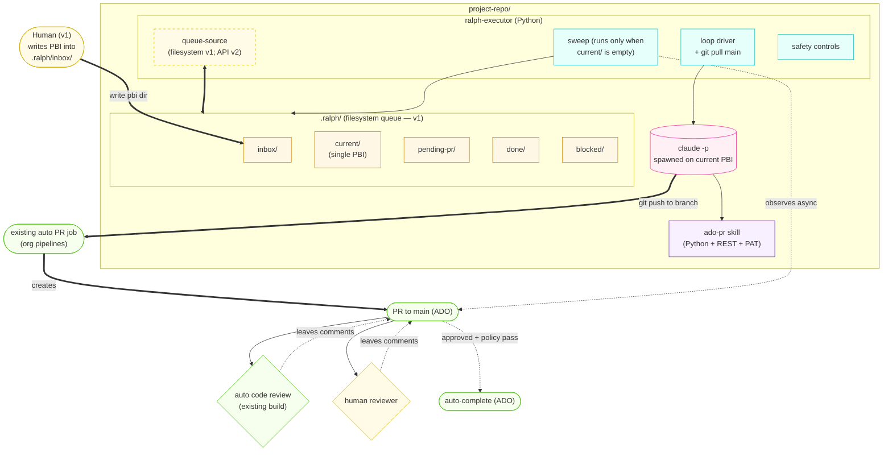
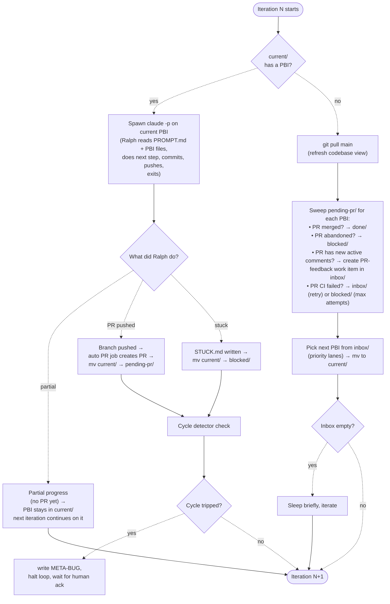

# Ralph v1 — Per-repo Loop Design

**Status:** Approved (design phase)
**Date:** 2026-05-23
**Author:** gethin (with Claude)
**Supersedes:** N/A (initial design)
**Umbrella reference:** [2026-05-23-ralph-umbrella-design.md](./2026-05-23-ralph-umbrella-design.md)

## Goal

A Python `ralph-executor` process that runs inside a project repository and drives an autonomous coding loop. The executor holds at most one PBI in `.ralph/current/` at a time — single-focus discipline, no context switching. When `current/` is empty, the executor sweeps prior PRs for state changes, then picks the next PBI from `.ralph/inbox/` and spawns `claude -p` against it. Ralph edits code, commits, pushes a branch — the org's existing auto PR job creates the PR. Ralph never waits for CI or human review.

v1 runs both locally (developer laptop) and on a ROSA deployment (long-running pod or Coder workspaces task pod) from a single binary, with environment-specific config differences only. Humans write PBIs directly into `.ralph/inbox/`; the supervisor, watchers, and memory integration are out of scope until v2.

## Non-goals

- **No supervisor service.** Humans write PBI directories by hand into `.ralph/inbox/`. The supervisor (with UI, MCP for Claude Code, signal ingestion) is v2.
- **No automated watchers.** Build / deploy / test / runtime watchers come in v2 alongside the supervisor.
- **No multi-Ralph per repo.** One executor per repo in v1. Multi-Ralph is v4+ if throughput demands it.
- **No automated triage Ralph.** All work entering Ralph's inbox is human-curated.
- **No reflection synthesis by Ralph.** Ralph reads memory and writes episodic observations; reflection synthesis is out-of-band (e.g. the existing better-memory synthesis flow).
- **No cross-repo coordination.** Each Ralph is scoped to one repository.

## Constraints

- **Runtime targets**: developer laptop (Windows/Mac/Linux) AND ROSA pod (Linux container). Same binary, different config. The ROSA deployment may be a **long-running pod** OR an ephemeral **Coder workspaces task pod** invoked per-PBI; both are viable and the executor's logical structure is identical either way (see open questions).
- **PR target**: PRs go to Azure DevOps. The existing **auto PR job** in the org's pipelines already creates PRs from pushed branches; Ralph leverages this rather than creating PRs directly.
- **ADO interactions** (read threads, reply to comments, set thread status): via a small **`ado-pr` Claude Code skill** containing Python scripts that call the ADO REST API. Documented endpoints + PAT-based auth. No additional MCP server needed.
- **Memory backend**: **not in v1.** Memory integration via [better-memory](https://github.com/emp3thy/better-memory) (or its BP-approved equivalent) is deferred to v2. See the [Memory section](#memory-integration-deferred-to-v2) for the v2 picture and rationale.
- **Authentication**: API key (Anthropic) for Claude — embedded as a ROSA pod secret; local dev uses env var. PAT (ADO) — embedded as a pod secret; local uses env var. No OAuth-based auth in any environment (would break unattended operation).
- **Queue storage**: `.ralph/` directory inside the project repo, git-tracked. Chosen so a failed pod run reproduces locally by cloning the repo at the failing commit. Cost is queue churn in git log (mitigated by distinctive commit author / message prefix; possibly a separate `ralph-queue` branch — see open questions).
- **Git refresh**: Ralph pulls latest `main` before picking up a new PBI, so its view of the codebase is current. Avoids stale-base-branch problems on long-running pods.

## Architecture



### Components

- **`.ralph/`** — queue state on the filesystem. Folder location = PBI state. Folders are git-tracked so a failed pod run reproduces locally. The `current/` folder holds AT MOST ONE PBI — the one Ralph is actively working on.
- **`ralph-executor`** — Python process with three concerns:
  - **queue-source**: reads from `.ralph/inbox/` in v1; in v2 will read from supervisor API. Abstracted so the loop doesn't care.
  - **loop driver**: pulls latest `main`, spawns `claude -p` against the PBI in `current/` (or picks next from inbox if current is empty), handles the outcome.
  - **safety controls**: STUCK.md handling, attempt counter, cycle detection, global halt.
- **`claude -p`** — Claude session spawned on the PBI in `current/`. Reads PROMPT.md (standing instructions at repo root) + PBI directory contents. Edits code, commits, pushes the branch (the existing auto PR job creates the PR), exits. Multi-step PBIs may take multiple iterations on the same PBI — the PBI stays in `current/` until done or stuck.
- **`ado-pr` skill** — small Claude Code skill containing Python scripts that wrap the ADO REST API (read threads, post replies, set thread status). PAT-based auth. Replaces what would otherwise be an ado-pr MCP — no extra server to install.
- **Existing auto PR job** — pre-existing pipeline automation that creates a PR when a branch is pushed. Ralph relies on this rather than creating PRs directly. The exact trigger mechanism is TBD during implementation.
- **Auto code review build** — pre-existing automated code review that runs against PRs and leaves comments. v1 leverages this as the primary mechanical safety mechanism (see Safety controls below). It's NOT something v1 builds.
- **Memory backend** — **not in v1.** Deferred to v2; see [Memory section](#memory-integration-deferred-to-v2).

## PBI conventions (folder layout, not schema)

A PBI is a **directory** with conventional file names. Frontmatter on the top-level file is minimal — just enough for the executor to schedule. Everything Ralph needs to do the work is in adjacent markdown files.

### Folder structure (general)

```
.ralph/inbox/<PBI-ID>/
├── (type-specific files — see below)
├── HISTORY.md      ← appended by executor after each attempt
├── STUCK.md        ← written by Ralph if it can't proceed (per-PBI halt)
└── CANCEL          ← empty file dropped by humans to abandon
```

### Feature PBI

```
.ralph/inbox/WI-1234/
├── PBI.md          ← human-written ask (context, acceptance prose, constraints)
├── PLAN.md         ← step-by-step implementation plan (superpowers-style)
├── HISTORY.md
├── STUCK.md / CANCEL
```

**Top-of-file frontmatter on PBI.md:**

```yaml
---
id: WI-1234
type: feature
status: inbox       # executor-managed: inbox | current | pending-pr | done | blocked | archive (verifying added in v2)
severity: normal    # critical | high | normal | low
attempts: 0         # executor-managed
---
```

**Processing**: Ralph reads PROMPT.md → HISTORY.md → PBI.md → PLAN.md, does the next unchecked step in PLAN.md, marks it done, commits. If all steps are now complete, Ralph pushes the branch (the auto PR job creates the PR). Otherwise Ralph just commits locally and exits — the PBI stays in `current/` and the next iteration continues with the following step. Multi-step features take multiple iterations.

### Bug PBI

```
.ralph/inbox/BUG-xxx/
├── BUG.md          ← failure context, signature, error excerpts
├── REPRODUCE.md    ← commands that demonstrate the failure locally
├── INVESTIGATE.md  ← debugging playbook for this CLASS of bug
├── HISTORY.md
├── STUCK.md / CANCEL
```

**Frontmatter on BUG.md:**

```yaml
---
id: BUG-deploy-rosa-irsa-2026-05-23
type: bug
status: inbox
severity: critical
attempts: 0
---
```

**Processing**: Ralph reads PROMPT.md → HISTORY.md → BUG.md → REPRODUCE.md → INVESTIGATE.md. Confirms it can reproduce the failure. Forms a hypothesis from INVESTIGATE.md. Applies a fix. Re-runs REPRODUCE.md commands. If they pass, pushes the branch (auto PR job creates the PR). If not, appends HISTORY.md and exits — the PBI stays in `current/` and the next iteration tries a different angle.

INVESTIGATE.md is per **category** of bug (e.g. `deploy-fail-rosa-irsa`, `build-fail-go-compile`, `test-flake-network`), not per-bug. The human triager attaches the appropriate one from a library (the **INVESTIGATE.md library**, maintained in a shared location — see open questions).

### PR-feedback PBI

```
.ralph/inbox/PR-feedback-WI-1234-r2/
├── FEEDBACK.md     ← templated content (PR link, comments, instructions to Ralph)
├── PR-LINK.md      ← url, branch, commit at time of feedback
├── ORIGINAL.md     ← copy of (or reference to) the original PBI
├── HISTORY.md
├── STUCK.md / CANCEL
```

**Frontmatter on FEEDBACK.md:**

```yaml
---
id: PR-feedback-WI-1234-r2
type: pr-feedback
status: inbox
severity: high      # high priority lane: closing PRs unblocks reviewer context
attempts: 0
---
```

**Processing**: Ralph reads PROMPT.md → HISTORY.md → ORIGINAL.md → FEEDBACK.md. Checks out the existing PR branch. For each active comment: decides correct/not/unclear, applies fix or prepares challenge, posts reply, sets ADO thread status (`fixed` if applied; leave `active` if challenged). Pushes commits to the same branch — the existing PR auto-updates.

The FEEDBACK.md template is the contract between the sweep (which generates it) and Ralph (which processes it). Same boilerplate every round.

## Iteration model — one PBI at a time, no context switching

**Single-focus discipline.** The `current/` folder holds at most one PBI. If it's occupied, that's what Ralph works on — period. No higher-priority bug can preempt; no parallel PBI work. When the current PBI reaches a terminal state (PR pushed → `pending-pr/`, or STUCK → `blocked/`), only THEN does the executor sweep prior PRs and pick the next item.

Rationale: context switches are expensive (each Ralph invocation is a fresh Claude session anyway, but committing partway through a multi-step PBI and switching to something else leaves the branch in an awkward intermediate state). Single-focus also makes the loop trivially debuggable: at any moment, "what is Ralph doing?" has one concrete answer.



### Iteration rules

1. **Always check `current/` first.** If it has a PBI, that's the next thing to work on.
2. **`git pull main` only when current is empty.** Don't pull mid-PBI — that risks pulling in changes that conflict with Ralph's in-flight branch. Pull at the boundary, between PBIs.
3. **Sweep only when current is empty.** Don't context-switch mid-PBI to respond to PR comments from earlier PRs. The PRs are async; their state will be picked up at the next boundary.
4. **Multi-step PBIs**: Ralph may need multiple iterations to complete a feature with several PLAN.md steps. Each iteration does the next unchecked step and commits. The PBI stays in `current/` across these iterations. The PR (and the move to `pending-pr/`) only happens when Ralph pushes the branch — typically when all PLAN.md steps are complete.
5. **Exception — cycle detection halt.** Even when busy with current, if cycle signals trip (across recently-completed PBIs), the loop halts pending human ack. The current PBI stays where it is.

### Sweep logic per pending PR

| PR state | Action |
|---|---|
| Merged (`completed` in ADO) | mv PBI to `done/` (v1: features AND bugs). Credit retrieved memories with `success`. Append HISTORY.md. (v2 adds `verifying/` step for bugs.) |
| Abandoned | mv PBI to `blocked/` with reason from PR. Memory not credited. |
| Open, CI red | If attempts < max → mv PBI to `inbox/` for retry; close PR. If attempts ≥ max → mv to `blocked/`. |
| Open, CI green, awaiting review | No-op. Auto-complete (ADO equivalent of auto-merge) is configured on the PR; merges when policies pass. |
| Open, new active comments since last sweep, not Ralph-authored | Create `PR-feedback` work item in `inbox/`. Comments come from BOTH human reviewers AND the auto code review build — both feed the same FEEDBACK.md template. Update `last_feedback_sweep` timestamp on PBI. PBI stays in `pending-pr/`. |
| Open, stale (no movement in N days) | Comment on PR pinging reviewer. Log. No PBI move. |

### Priority lanes for picking next PBI

Lanes in priority order — drain each completely before moving to the next:

1. **PR-feedback** — closing PRs unblocks reviewer context; comments tend to be small/targeted.
2. **Critical bugs** — build failures, deploy failures, production outages.
3. **High bugs** — runtime errors, test failures.
4. **Normal bugs and features** — with age-based escalation (a normal bug aged > 7 days promotes to high).
5. **Low priority** — drained when above lanes are empty.

The lane decision is part of the queue-source abstraction — in v1 it's a sort of `.ralph/inbox/*/` directories by frontmatter; in v2 the supervisor enforces ordering on its side.

## PR feedback workflow (ADO)

### Tooling

| Operation | ADO mechanism |
|---|---|
| Open PR | NOT done by Ralph — the existing auto PR job creates it when Ralph pushes the branch. |
| Read threads/comments | `GET /pullRequests/{id}/threads` |
| Reply to thread | `POST /pullRequests/{id}/threads/{tid}/comments` |
| Set thread status | `PATCH /pullRequests/{id}/threads/{tid}` (status: `fixed`, `closed`, etc.) |
| Auto-complete on policy pass | Handled by the existing auto PR job + ADO branch policies; not Ralph's responsibility. |
| Watch PR state | `GET /pullRequests/{id}` or `az repos pr show` |

Ralph invokes these via the **`ado-pr` Claude Code skill**: a small skill containing Python scripts that wrap the ADO REST API. Auth is via PAT (env var locally, secret on ROSA). Documented endpoints, no MCP server to install. Ralph calls the skill via the `Skill` tool the same way it'd call any other Claude Code skill.

Operations the skill exposes (one Python entry-point per operation):

- `ado-pr read-threads <pr-id>` — JSON list of threads + comments + status
- `ado-pr reply <pr-id> <thread-id> <text>` — post a reply to a thread
- `ado-pr set-status <pr-id> <thread-id> <status>` — set thread status (`fixed`, `closed`, etc.)
- `ado-pr show <pr-id>` — current PR state, CI results, reviewer decisions

The skill documentation includes the REST endpoint each operation maps to, so a developer reading the skill can understand exactly what API calls are made.

### Thread status semantics

| ADO status | Ralph behaviour |
|---|---|
| `active` | What Ralph processes |
| `pending` | Skip (comment not posted) |
| `fixed` | Ralph sets after applying a fix |
| `closed` | Ralph sets after reviewer accepts a challenge |
| `wontFix` | Human-only — Ralph never sets |
| `byDesign` | Human-only — Ralph never sets |

### FEEDBACK.md template (boilerplate)

The sweep generates FEEDBACK.md from a fixed template. Only the per-comment block list varies — everything else (header, instructions, constraints) is the same every round.

```markdown
# PR feedback — PBI <PBI-ID> — round <N>

**PR:** !<PR-ID> — "<PR title>"
**Branch:** ralph/<PBI-ID>
**Commit at time of feedback:** <SHA>
**Reviewers:** <reviewer emails>
**Feedback collected at:** <ISO timestamp>

## Active comments

### Comment 1 — file: <path>, line <N>   (or "general" for non-file comments)
- **Thread ID:** <ADO thread id>
- **Reviewer:** <email>
- **Posted:** <ISO timestamp>

> <verbatim comment text>

---

### Comment 2 — ...
(repeat for each active, non-Ralph-authored comment)

---

## Instructions for Ralph

For each active comment above:

1. **Read the comment carefully** and examine the referenced code
   (file:line for line comments; the diff for general comments).

2. **Decide: is the reviewer correct?**
   - If the concern is valid → implement the fix.
   - If the concern is incorrect or based on a misunderstanding →
     don't change the code. Prepare a clear, respectful reply explaining why.
   - If you can't tell from available context → write STUCK.md
     with what's unclear.

3. **Always reply.** Use the `ado-pr` skill to post in the thread.
   Tell the reviewer:
   - What you changed (filename, line, brief description), OR
   - Why you didn't change anything (your reasoning).

4. **Set thread status after replying:**
   - Applied a fix → set thread to **fixed**.
   - Challenged AND your reasoning is strong → leave **active**;
     the reviewer will close it after reading.
   - Never set **wontFix** or **byDesign** — those are human-only.

5. **Commit and push** to the existing branch after all comments addressed.
   The PR will auto-update and CI re-runs.

## Constraints
- Don't open a new PR. Push commits to the existing branch.
- Don't address comments outside this FEEDBACK.md (no scope creep).
- If a comment references work that should be a separate PBI
  ("can we also rename X?"), note it in your reply and don't do it here.
- If you challenge and the reviewer later responds with a counter, that
  becomes a new FEEDBACK round — don't try to predict their response.
```

The instructions are part of the template — same every round. The variability is only in the comment list above the instructions.

## Safety controls

Three independent layers. With human-curated input, these are belt-and-braces, not load-bearing.

### Layer 1 — Ralph self-halt (STUCK.md)

Ralph writes `STUCK.md` instead of attempting a fix when it recognises it's stuck. Per-PBI halt — the loop continues, this PBI goes to `blocked/`.

**Triggers** (described in PROMPT.md):
- HISTORY.md shows 2+ prior attempts and the planned approach is materially similar to one of them
- attempts ≥ 3 with no clear new angle (default-stuck unless Ralph can articulate why this is different in writing)
- Contradictory evidence (test passes locally, fails in CI at the same commit)
- PBI is ambiguous or contradicts existing code conventions
- Fix would require deleting tests, widening permissions, or touching files outside declared scope without justification

**STUCK.md structure**: what I tried / what's blocking me / what would unblock me / my confidence with help (0–100%).

### Layer 2 — Existing auto code review + human reviewers (PR comment loop)

**v1 does NOT add a separate "PR guards" mechanical check stage.** The organisation already has an auto code review build that runs against PRs and leaves comments, and human reviewers add further comments. Both feed the PR comment stream, which is what v1 routes back to Ralph as PR-feedback work items.

The job of this layer is therefore "review feedback gets to Ralph and gets addressed":

| Source of comment | What v1 does |
|---|---|
| Human reviewer | Sweep picks up the comment; FEEDBACK.md work item created; Ralph addresses or challenges per the standard instructions. |
| Auto code review build | Same as above. The auto code review's comments are indistinguishable from human comments to the sweep — both are ADO PR comments. |
| Critical concerns (test deletion, scope creep, permission widening, security issues, etc.) | These are caught by either the auto code review (which knows the codebase's conventions) or by the human reviewer. They land as PR comments and the comment routing handles them. If the comment is severe enough to block merge, the reviewer leaves it `active` and the ADO branch policy prevents merge until resolved. |

**Why no separate mechanical guards in v1**: the auto code review already exists and is the team's known mechanism for catching code-quality issues. Adding a parallel "ralph-guards" CI stage would be a second, redundant safety net with its own maintenance cost. Better to make the existing review process the gate, and have Ralph respond to it cleanly via FEEDBACK.md.

**What v1 specifically watches for via comment routing** — these are categories of comment that the FEEDBACK.md instructions tell Ralph to treat seriously (not just "address mechanically"):

- "You removed a test" — Ralph should restore unless the test was genuinely obsolete; if the latter, justify in reply.
- "You changed file X which is outside the declared scope of this PBI" — Ralph reverts or justifies.
- "You widened permissions / changed IAM" — Ralph reverts unless the PBI explicitly authorises it.
- "This is too large a change to review safely" — Ralph splits, or writes STUCK.md.

PROMPT.md (the standing Ralph instructions) includes these as elevated-attention categories — same boilerplate every iteration.

**v2 may add a thin mechanical "ralph-guards" CI stage** if data shows specific failure modes the auto code review isn't catching. v1 doesn't.

### Layer 3 — Global cycle detection (executor)

Tracks patterns across PBIs over a rolling window. Each signal alone might be noise; combinations trigger a global halt.

| Signal | v1 threshold | Notes |
|---|---|---|
| Signature recurrence | Same bug signature within 24h of a previous one being closed | Suggests fix didn't address root cause |
| Whack-a-mole | Close-rate ≈ create-rate over 4h window | Each fix introduces another bug |
| Same-file thrashing | Same file modified via > 5 PRs in 24h | Wrong abstraction; surface fixes that miss root |
| Regression cascade | Tests green before recent merge now red, signature matches recently-merged "done" bug | Worst case: Ralph re-introduced a bug it just fixed |
| Attempt-count divergence | Average attempts-per-PBI rising over window | Underlying quality degrading |
| Blocked-queue growth | `blocked/` growing faster than `done/` | Triage drift; work entering that Ralph can't do |

**Storage**: events table in a small SQLite database under `.ralph/state/events.db` (or just JSONL append-only log). Detector runs as a periodic check at iteration boundaries.

### Halt and acknowledgement

On cycle trip:

1. Freeze the PBI in `current/` (don't kick back to inbox)
2. Snapshot state: queue contents, recent PRs, recent HISTORY.md, signal trace
3. Write a META-BUG file in `.ralph/blocked/` with the snapshot attached
4. Page human if working hours (configurable webhook); queue for morning otherwise
5. Executor refuses to restart until META-BUG is marked acknowledged (a sentinel file or supervisor API call)

**Automatic-restart-on-cooldown is explicitly wrong** — same cycle just re-triggers.

## Memory integration (deferred to v2)

**v1 does not include memory integration.** Ralph reads PROMPT.md + the PBI directory + HISTORY.md each iteration; the latter provides short-term per-PBI memory across attempts. Cross-PBI learning (Ralph getting better at a codebase over time) is a v2 capability.

### Why deferred

- v1 already has enough novel parts (executor, folder conventions, ADO skill, single-PBI focus discipline, PR-feedback workflow). Adding memory integration on top risks the spec being too large to land in a sensible first cut.
- Memory integration is genuinely additive: v1 works without it (Ralph just doesn't accumulate cross-PBI knowledge). Adding it later is straightforward — install the MCP, register the hooks, no v1 code changes needed.
- The ROSA-side memory backend is TBD (specific BP-approved service). v1 doesn't depend on resolving that.

### What v2 looks like (reference)

The local target is [better-memory](https://github.com/emp3thy/better-memory): a Claude Code MCP server with three Claude Code hooks:

- **`SessionStart` hook (`session_bootstrap`)** — at the start of every Claude session, injects relevant memory as `additionalContext`. Ralph does NOT have to call any retrieve tool — the bootstrap is automatic, transparent to the prompt.
- **`PostToolUse` hook (`observer`, async)** — captures observations during work (after Write / Edit / Bash tool uses), without blocking the session.
- **`Stop` hook (`session_close`, async)** — flushes the work into a background "episode" that's later distilled into reflections.

Project scoping is automatic via `git rev-parse --git-common-dir`, so each repo's Ralph automatically gets its own memory bucket.

For v2 on ROSA, the BP-approved memory service must expose:
- The same MCP tool surface (or near-enough that Ralph's tool-permissions list works without change)
- Equivalent hook integration (or hooks adapted to the BP service)
- Local-only data storage (better-memory's local-only property is the design constraint to match)

### Memory credit timing (v2)

When memory IS integrated:

- **Features**: credit memories Ralph used on PR merge (sweep observes merge → executor signals success).
- **Bugs (v2 with watchers)**: credit after the verifying period passes (watcher silent for N hours). If the watcher re-fires within the window, credit `failure` instead, and reopen the bug.

The `verifying/` folder enters the lifecycle alongside watchers in v2 and is paired with memory credit.

## Local vs ROSA differences

`ralph-executor` is the same binary in both environments. Differences are in config and the memory MCP backend.

| Concern | Local | ROSA pod |
|---|---|---|
| Deployment model | Run as a script in a terminal; loop iterates until Ctrl+C | EITHER a long-running pod (executor loops) OR a Coder workspaces task pod per PBI (pod runs one PBI, exits). See open questions. |
| Claude auth | Anthropic API key (env var) | API key as a pod secret (`ANTHROPIC_API_KEY` env in pod manifest) |
| ADO auth | PAT in env | PAT as a pod secret |
| `claude -p` permissions | Interactive prompts tolerated | `--dangerously-skip-permissions` + explicit `permissions.allow` for every tool Ralph could need. Must run `ralph-doctor` preflight. |
| Hooks | All Claude Code hooks active | Only ralph-safe hooks active; no hooks that call `AskUserQuestion` or block on user input |
| Working directory | Developer's local clone | Fresh `git clone` on pod start; ephemeral |
| Logs | stdout | stdout → captured by k8s; aggregated to log store |
| Halt-and-ack notification | Print to terminal | Webhook to Slack / Teams / pager |
| Memory backend | (v2) `better-memory` MCP + hooks | (v2) BP-approved service with equivalent MCP + hook surface |

**The most important pod-only thing**: every silent failure on a pod has the same cause — `claude -p` hit a permission prompt because some hook or skill expected a user. `ralph-doctor` (v1 skill) must pass before any pod deploy. If it can't pass, the pod doesn't start.

### `ralph-doctor` checks (TBD detailed list, but at minimum)

- `permissions.allow` in `.claude/settings.json` covers every tool Ralph might call (Bash, Edit, Write, Read, Grep, Glob, the ado-pr MCP, the memory MCP)
- No hook in the active set calls `AskUserQuestion` or blocks on stdin
- No skill in the active set calls `AskUserQuestion` in its main path
- MCP servers all configured with non-interactive auth (no OAuth refresh prompts)
- Anthropic / Bedrock auth resolves on cold start (don't fail at iteration 100)
- The ADO PAT / managed identity can read repos and create PRs

## Testing approach (sketch — full plan in implementation)

The executor is plain Python and should be testable end-to-end without ever invoking Claude:

- **Unit tests** per safety control (cycle detector with synthetic event sequences; PR guards against canned diffs; STUCK.md handling)
- **Integration tests** with a mock claude-p (a script that writes a canned PR-creation result), a mock ADO (returns canned responses), and a temporary `.ralph/` directory
- **End-to-end smoke** on a throwaway test repo with a real Claude session and a tiny PBI ("add a comment to this file") — runs in CI for this repo before any release

Pre-deploy gate: `ralph-doctor` must pass in the target environment's container image.

## Non-goals for v1 (explicit)

- No supervisor service. Humans write PBIs by hand. (v2)
- No watchers — no automated bug ingestion from build/deploy/test/runtime. (v2)
- No supervisor MCP for Claude Code or VS Code. (v2/v3)
- **No memory integration.** Ralph reads PROMPT.md + the PBI directory + HISTORY.md only. Cross-PBI memory comes in v2. (deferred)
- **No separate "ralph-guards" CI stage.** The existing auto code review + human reviewers fill the role of the mechanical guards I'd originally proposed. v2 may add specific guards if data shows the auto review is missing a category. (deferred)
- **No ado-pr MCP server.** ADO interactions are via the `ado-pr` Claude Code skill (Python + REST + PAT). (deliberate)
- No automated triage. All routing decisions are human. (v3+)
- No multi-Ralph. One Ralph per repo. (v4+ if needed)
- No automated cross-repo coordination. Each Ralph is repo-scoped. (out of scope, possibly forever)
- No reflection synthesis written by Ralph. (v2 deferred — and even then, episodic only; reflection synthesis stays a separate batch process)

## Open questions (don't block v1 implementation; resolve during build)

- **Long-running pod vs Coder workspaces task pod for ROSA deployment.** A long-running pod runs the executor as a daemon, iterating continuously. A task-pod model dispatches one pod per PBI (pod starts, runs Ralph on the assigned PBI, exits). Both are viable; the executor's logic is the same. Task pods are cleaner for resource lifecycle (no idle compute) but require a scheduler component. Decide based on what the team's ROSA + Coder usage favours.
- **Auto PR job integration.** The org has an existing auto PR job that creates PRs from pushed branches. The exact trigger mechanism (push to `ralph/*`? a specific commit message? a tag?) is TBD during implementation. Whatever it is, Ralph adheres to it.
- **`ralph-queue` branch vs main branch for queue commits.** Pollution of git log in main is a real cost. Putting the queue on a `ralph-queue` branch (rebased off main) avoids it but adds branch-juggling complexity. Decide during implementation, possibly after running v1 for a sprint with queue-on-main and measuring noise.
- **INVESTIGATE.md library location.** A shared library of debugging playbooks (per category of bug) needs to live somewhere accessible to all repos. Options: a separate `ralph-playbooks` repo, a section of the supervisor, or files in each repo. Likely the playbooks repo is the right answer once v2 lands; for v1, ship a small set in this repo (`docs/playbooks/`) and reference them from PBIs.
- **`ralph-doctor` skill location.** Skills live in `~/.claude/skills/`. The skill should be installable from this repo. Document the install path during implementation.
- **Sweep cadence on long-running pods.** If the pod is constantly busy with iterations, sweep runs naturally at PBI boundaries. If iterations are sparse, sweep should also run on a timer (e.g. every 5 minutes) so PR state doesn't lag. Decide based on observed behaviour.
- **`git pull main` strategy on long-running pods.** Pulling at PBI boundaries is the rule, but if `main` has moved significantly while a multi-step PBI is in progress, the in-flight branch may need to rebase before the next step. Rebase-on-pull at PBI boundary is the likely answer; verify during implementation.

## Implementation order (rough)

1. **Folder conventions + sample PBIs** — write a sample feature PBI, a sample bug PBI, a sample feedback PBI by hand. Verify they're parseable and readable. (No code yet.)
2. **`ado-pr` skill** — Python scripts wrapping the four operations (read-threads, reply, set-status, show). PAT auth. Test locally against a sandbox ADO repo.
3. **PROMPT.md** — write the standing prompt that Ralph uses every iteration. Iterate by spawning `claude -p` against the sample PBIs locally.
4. **Executor core** — loop driver, queue-source (filesystem), spawning `claude -p`, moving folders. Implement the `current/`-folder discipline (single-PBI focus). Include `git pull main` at PBI boundaries. Skip safety controls for now.
5. **Sweep logic** — observe PR state changes (via `ado-pr show`), generate PR-feedback work items from new comments, move PBIs appropriately. Mock ADO for testing.
6. **Safety controls** — Ralph self-halt (STUCK.md handling), cycle detector with synthetic-event tests.
7. **`ralph-doctor`** — preflight skill.
8. **ROSA packaging** — container image, k8s manifest, secrets wiring (Anthropic API key, ADO PAT). Decide long-running-pod vs Coder-task-pod model based on team usage.
9. **End-to-end smoke** on a throwaway test repo.

Each step is a separate implementation plan (`docs/superpowers/plans/`) once this spec is approved.
